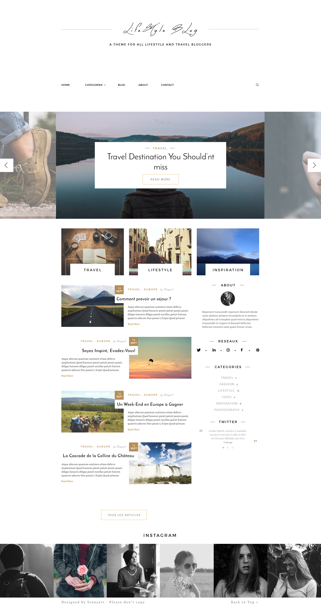

# Личный проект «Бложик»

<table>
  <thead>
    <tr>
      <th>Команда</th>
      <th>Результат</th>
    </tr>
  </thead>
  <tbody>
    <tr>
      <td width="30%"><code>npm i</code></td>
      <td>Установить зависимости</td>
    </tr>
    <tr>
      <td><code>npm start</code></td>
      <td>Запустить сборку, сервер и слежение за файлами</td>
    </tr>
    <tr>
      <td><code>npm start ЗАДАЧА</code></td>
      <td>Запустить задачу с названием ЗАДАЧА (список задач в <code>gulpfile.js</code>)</td>
    </tr>
  </tbody>
</table>

---

## _Не удаляйте и не обращайте внимание на файлы:_
*	### `.editorconfig`
*	### `.gitignore`
*	### `.travis.yml`
*	### `package.json`
*	### `.csscomb.json`
---
## ТЗ
С помощью bootstrap(или если по каким то причинам вы не хотите его
использовать, то используй что угодно, но нужно будет обосновать почему был
сделан такой выбор) сверстать блог. Он должен состоять из шапки, основной
части сайта с боковым меню и подвала. Должен состоять из следующих
страниц.
* Главная страница
* Детальная страница новости
* Страница списка записей по конкретной категории
* Страница "Обо мне"
---

 
